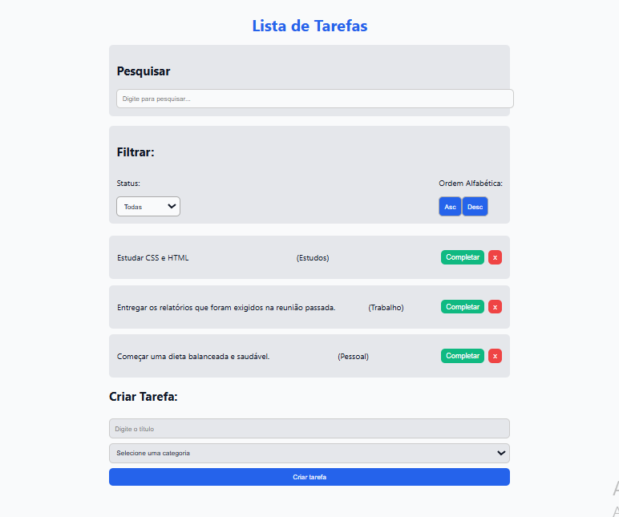
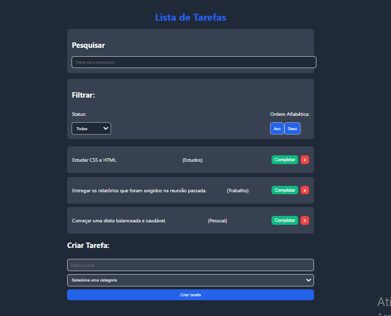

# 📋 TaskList

**TaskList** is a modern and responsive web application for managing tasks, built with **React** and **pure CSS**—no external styling libraries. The app includes **dark/light mode**, **filter options**, **real-time search**, and a **clean, user-focused interface**.

## ✨ Features

- ✅ Add, complete, and delete tasks  
- 🎯 Filter by status (All, Active, Completed)  
- 🔎 Real-time task search by title  
- 🌙 Toggle between light and dark themes  
- 📱 Fully responsive layout for all screen sizes  
- 🧑‍💻 Clean and professional UI with focus on readability  

## 📸 Project Preview

| Light Theme | Dark Theme |
|-------------|------------|
|  |  |

## 🚀 Getting Started

Clone the repository and install the dependencies:

```bash
git clone https://github.com/your-username/TaskList.git
cd tasklist/to-do-list
npm install
npm run dev
```

Then open your browser at `http://localhost:5173`

## 🛠️ Built With

- **React** — A JavaScript library for building user interfaces  
- **Vite** — Lightning-fast frontend tooling  
- **Vanilla CSS** — Custom styles, no CSS frameworks used

## 📄 License

This project is licensed under the MIT License. See the [LICENSE](../LICENSE) file for details.
